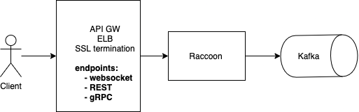

# Publishing Events

## EndPoint

Raccoon can be hosted behind a proxy/API GW, a sample of blocks as below.



The API path which accepts events is:

**/api/v1/events**

### Authorization/Authentication

Raccoon does not provide features to perform any authorization or authentication of the user/client initiating the connection. It accepts connections as trusted \(and assumes any such auth is already performed\)

### HTTP backend

SSL termination is outside the scope of Raccoon, and the service API accepts HTTP connections assuming that the SSL is terminated at a proxy or ELB before reaching Raccoon.

## Protos

Raccoon accepts an EventRequest proto that wraps multiple Event proto. This enables clients to send an event in real-time or multiple events in batches.

Refer to [EventRequest.proto](https://github.com/odpf/proton/blob/main/odpf/raccoon/EventRequest.proto) for how you can build the request.

```text
message EventRequest {
  string req_guid = 1;
  google.protobuf.Timestamp sent_time = 2;
  repeated Event events = 3;
}
```

Where **req\_guid** - A globally unique ID generated by the client denoting this request as unique **sent\_time** - This is when the event is sent over the WebSocket in protobuf timestamp format. This time is used to calculate latencies in Raccoon. **events** - are events of type Event proto which is of the format

Refer to the [Event.proto](https://github.com/odpf/proton/blob/main/odpf/raccoon/Event.proto) for how the event could be composed of.

```text
message Event {
  // Data/byteArray of the serialised product proto.
  bytes eventBytes = 1;
  /* This is the protoMessageName which the protoc provides with each compiled proto. This type is used by raccoon to distribute events to respective Kafka topics.
  */
  string type = 2;
 }
```

Where **eventBytes** - is a byte array serialized by the event proto \(eg. ViewedEvent.proto\) serializer client **type** - event type which Raccoon uses to distribute the events to Kafka topics. More details in the following sections.

Clients build the event array and compose the EventRequest proto, send them through the WebSocket client.

Raccoon also wires response every time a message is read and processed.

Refer to the [EventResponse.proto](https://github.com/odpf/proton/blob/main/odpf/raccoon/EventResponse.proto) that Raccoon sends for every event.

```text
message EventResponse {
  Status status = 1;
  Code code = 2;
      /* time when the response is generated */
  int64 sent_time = 3;
      /* failure reasons if any */
  string reason = 4;
      /* Usually detailing the success/failures */
  map<string, string> data = 5;
}

enum Status {
    UNKNOWN_STATUS = 0;
      /* signifies request success */
    SUCCESS = 1;
      /* server request failures */
    ERROR = 2;
}

enum Code {
    UNKNOWN_CODE = 0;
          /* successfully read and deserialized */
    OK = 1;
          /* usually deserialization failures */
    BAD_REQUEST = 2;
          /* server runtime errors */
    INTERNAL_ERROR = 3;
          /* signifies max connection reached at the server */
    MAX_CONNECTION_LIMIT_REACHED = 4;
          /* signifies a user reached max connections allowed.Defaults to 1 */
    MAX_USER_LIMIT_REACHED = 5;
}
```

The above response model is self-explanatory. Clients can choose to retry for error codes such as Code=\[3\|4\]

## Headers

Raccoon service accepts headers to identify a user connection uniquely. The header name is made configurable as it enables clients to specify a header name that works for them. For, e.g. for a mobile app having a request header as `X-User-id` which identifies the user \(client\) connecting to Raccoon, can configure Raccoon service with the config set as below `SERVER_WEBSOCKET_CONN_UNIQ_ID_HEADER=X-User-id`

Raccoon uses the config to fetch the header name and uses the value passed in the request header with this name, as the connection id. This header name uniquely identifies a client. A client, in this case, can be the user in the app.

The following header is a sample providing a user id: 654785432. Once the client initiates a WebSocket upgrade request over Raccoon, assuming the request is upgraded, and the client connection is established, Racoon accepts the header and extracts the user id to build a connection map. This map helps deduplicate connections for a user within the same raccoon instance.

```text
{
    "X-User-id": "654785432"
}
```

## Topics

Raccoon distributes events to a topic based on the event type. The protobufs section above clarifies how the type should be set in the event. The type is a string literal. For example, ViewedEvent - which signifies that the user viewed something on the app or the site can have its event type set as below `type = viewedevent`

When raccoon API consumes a batch array of events \(events in EventRequest proto\), it deserializes them and fetches the individual events \(using the EventRequest proto\), and constructs the topic to send each event to based on the `type` field set in each of the events.

The following code determines the topic name.

```text
topic := fmt.Sprintf(pr.topicFormat, event.Type)
```

where **topicformat** - is the configured pattern `EVENT_DISTRIBUTION_PUBLISHER_PATTERN` **type** - is the type set by the client when the event proto is generated

For e.g. setting the

```text
EVENT_DISTRIBUTION_PUBLISHER_PATTERN=topic-%s-log
```

and a type such as `type=viewedevent` in the event

will have the topic name as `topic-viewedevent-log`

