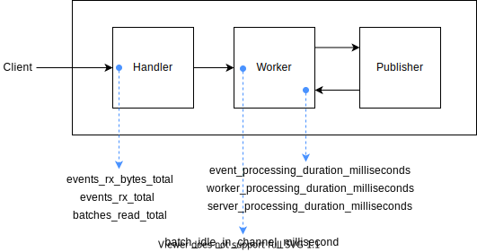

# Metrics

Raccoon uses Statsd protocol as way to report metrics. You can capture the metrics using any supported statsd collector like [Telegraf](https://github.com/influxdata/telegraf).

- [Server Connection](metrics.md#server%20connection): Connection related metrics such as connection count
- [Kafka Publisher](metrics.md#kafka%20publisher): Publisher related metrics such as total delievered
- [Resource Usage](metrics.md#resource%20usage): Resource related metrics such as memory, number of goroutine, etc
- [Event Delivery](metrics.md#event%20delivery): Event related metrics such as latency, delievered count, etc

## Server Connection
### `server_ping_failure_total`
Total ping that server fails to send
- Type: `Counting`

### `server_pong_failure_total`
Total pong that server fails to send
- Type: `Counting`

### `connections_count_current`
Number of alive connections
- Type: `Gauge`

### `user_connection_success_total`
Number of successful connections established to the server
- Type: `Count`

### `user_connection_failure_total`
Number of fail connections established to the server
- Type: `Count`
- Tags: `reason=ugfailure` `reason=exists` `reason=serverlimit`

### `user_session_duration_milliseconds`
Duration of alive connection per session per connection
- Type: `Timing`
  
## Kafka Publisher
### `kafka_messages_delivered_total`
Number of delivered events to Kafka
- Type: `Count`
- Tags: `success=false` `success=true`

### `kafka_unknown_topic_failure_total`
Number of delivery failure caused by topic does not exist in kafka.
- Type: `Count`
- Tags: `topic=topicname`

### `kafka_tx_messages_total`
Total number of messages transmitted (produced) to Kafka brokers.
- Type: `Gauge`

### `kafka_tx_messages_bytes_total`
Total number of message bytes (including framing, such as per-Message framing and MessageSet/batch framing) transmitted to Kafka brokers
- Type: `Gauge`

### `kafka_brokers_tx_total`
Total number of requests sent to Kafka brokers
- Type: `Gauge`
- Tags: `host=broker_nodes` `broker=true`

### `kafka_brokers_tx_bytes_total`
Total number of bytes transmitted to Kafka brokers
- Type: `Gauge`
- Tags: `host=broker_nodes` `broker=true`

### `kafka_brokers_rtt_average_milliseconds`
Broker latency / round-trip time in microseconds
- Type: `Gauge`
- Tags: `host=broker_nodes` `broker=true`

## Resource Usage
### `server_mem_gc_triggered_current`
The time the last garbage collection finished in Unix timestamp
- Type: `Gauge`

### `server_mem_gc_pauseNs_current`
Circular buffer of recent GC stop-the-world in Unix timestamp
- Type: `Gauge`

### `server_mem_gc_count_current`
The number of completed GC cycle
- Type: `Gauge`
  
### `server_mem_gc_pauseTotalNs_current`
The cumulative nanoseconds in GC stop-the-world pauses since the program started
- Type: `Gauge`

### `server_mem_heap_alloc_bytes_current`
Bytes of allocated heap objects
- Type: `Gauge`

### `server_mem_heap_inuse_bytes_current`
HeapInuse is bytes in in-use spans
- Type: `Gauge`

### `server_mem_heap_objects_total_current`
Number of allocated heap objects
- Type: `Gauge`

### `server_go_routines_count_current`
Number of goroutine spawn in a single flush
- Type: `Gauge`

### `server_mem_stack_inuse_bytes_current`
Bytes in stack spans
- Type: `Gauge`

## Event Delivery
Following metrics are event delivery reports. Each metrics reported at a different point in time. See the diagram below for to understand when each metrics are reported.

### `events_rx_bytes_total`
Total byte receieved in requests
- Type: `Count`

### `events_rx_total`
Number of events received in requests
- Type: `Count`

### `batches_read_total`
Request count
- Type: `Count`
- Tags: `status=failed` `status=success` `reason=*`

### `batch_idle_in_channel_milliseconds`
Duration from when the request is received to when the request is processed. High value of this metric indicates the publisher is slow.
- Type: `Timing`
- Tags: `worker=worker-name`

### `event_processing_duration_milliseconds`
Duration from the time request is sent to the time events are published. This metric is calculated per event by following formula `(PublishedTime - SentTime)/CountEvents`
- Type: `Timing`

### `server_processing_latency_milliseconds`
Duration from the time request is receieved to the time events are published. This metric is calculated per event by following formula`(PublishedTime - ReceievedTime)/CountEvents`
- Type: `Timing`

### `worker_processing_duration_milliseconds`
Duration from the time request is processed to the time events are published. This metric is calculated per event by following formula`(PublishedTime - ProcessedTime)/CountEvents`
- Type: `Timing`
